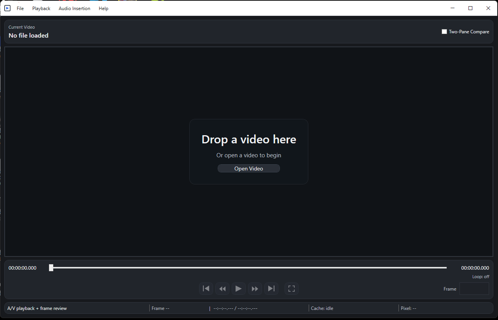
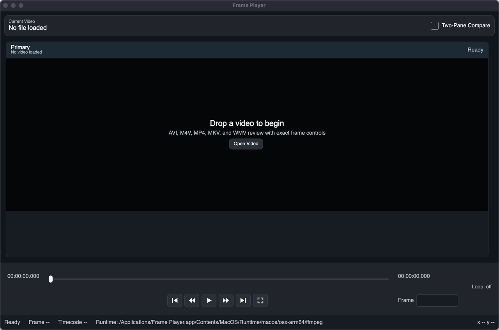
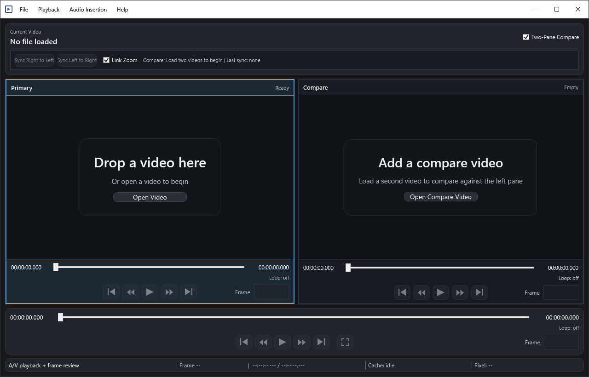
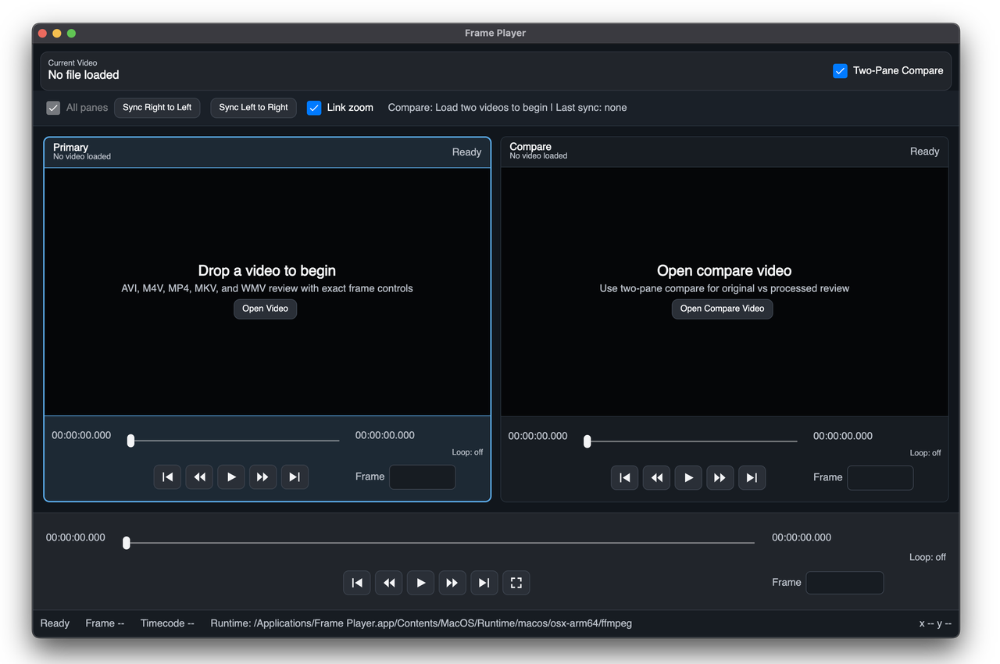

# Frame Player Wiki

Frame Player is a frame-first video review tool for people who need to know exactly which frame they are looking at. It supports single-video review, two-pane compare review, frame stepping, frame jumps, loop review, and export workflows.

## Downloads

| Release track | Platform | Current release | Download |
| --- | --- | --- | --- |
| Windows stable | Windows 10 or later | `v1.8.4` | [Frame Player v1.8.4](https://github.com/jfleezy23/frame-player/releases/tag/v1.8.4) |
| macOS Preview | Apple Silicon, macOS 13 or later | `0.1.0` | [Unified v1.8.4 download page](https://github.com/jfleezy23/frame-player/releases/tag/v1.8.4) |
| Windows Avalonia Preview | Windows 10 or later, x64 | `0.1.0` | [Unified v1.8.4 download page](https://github.com/jfleezy23/frame-player/releases/tag/v1.8.4) |

The Windows release remains the stable WPF app. The macOS Preview and Windows Avalonia Preview are controlled Avalonia preview builds for cross-platform validation.

## Screenshot Gallery

These are real app captures. The current checked-in shots show empty-state layouts because clean loaded-video Windows screenshots were not available in this docs pass.

| Windows stable | macOS Preview |
| --- | --- |
|  |  |
|  |  |

## What To Read Next

- [Getting Started](Getting-Started): install and open your first video.
- [User Guide](User-Guide): transport controls, frame entry, status bar, and diagnostics.
- [Two-Pane Compare](Two-Pane-Compare): compare panes, Sync, Link Zoom, and focused-pane behavior.
- [Looping And Export](Looping-And-Export): loop in/out, loop playback, clip export, compare export, and audio insertion.
- [Troubleshooting](Troubleshooting): audio, unsupported media, recent files, logs, and diagnostics.
